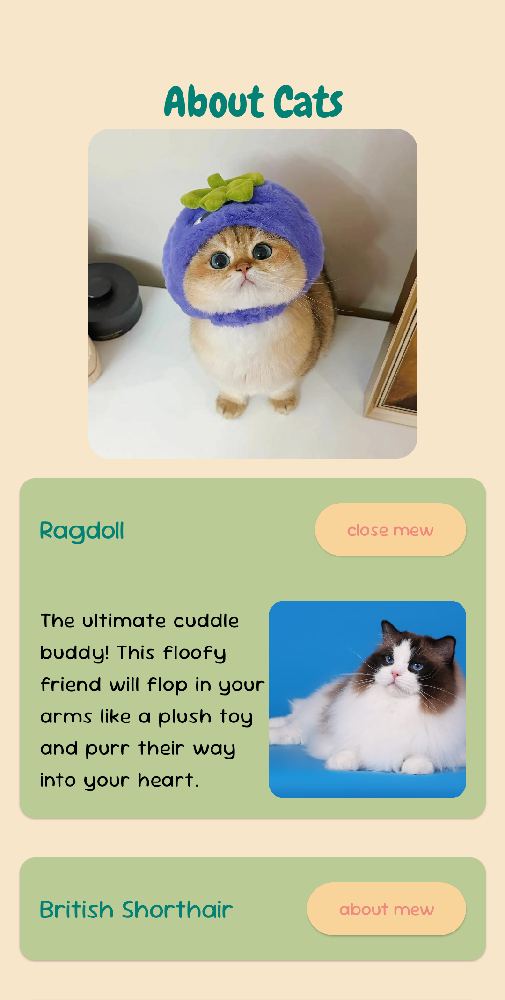

# About Cats - Android App

This is my very first Android project using Jetpack Compose. It showcases information about different cat breeds, including their names, descriptions, and images.

---

## Features

1. **Dynamic Content**: 
   - Displays information about various cat breeds loaded from a JSON file.
   
2. **Interactive UI**:
   - Expandable sections for each cat breed to show more details.
   - Includes an `about mew/close mew` toggle button to show or hide additional information.

3. **Theme**:
   - Pastel color palette for a soft and cute aesthetic.
   - Fonts: SugurGummy and Chewy.

4. **Image Integration**:
   - Displays images of cat breeds using resources loaded dynamically from the application.

---

## Project Structure

### Main Components

1. **`MainActivity`**:
   - Entry point of the application.
   - Sets up the UI using Jetpack Compose.
   - Loads the cat data from a JSON file (`cats_info.json`).
   - Shows the conetnt of app in a Box and by calling `AllSections()` composable function.

2. **Data Model**:
   - `CatBreed`: A class for storing cat data such as `name`, `description`, and `imageResId`.

3. **Utility Function**:
   - `loadDataFromJson`: Parses the JSON file to read cats information.
  
4. **Composable Functions**:
   - **`AppHeader`**: Displays the app title and header image, which are stored in a Column.
   - **`AppSection`**: Displays a single cat breed's name and a toggleable button for details. A hoist state called `expanded` is defined here and when the state of this variable changes when the button is presseed. If the `expanded.value` is True, then the `CatDetails()` function is called to show more information about the cat.
   - **`CatDetails`**: Shows the description and image of the cat breed when expanded.
   - **`AllSections`**: This function is implemented using LazyColumn, which is scrollable, and it contains `AppHeader()` and `AppSection()`.

---

## Usage

If you have installed Android Studio, you can simply clone the project and run it on your computer.

---

## Preview

### Header
- Displays the title "About Cats" and a main menu image.

### Cat Breed List
- A vertically scrollable list of cat breeds.
- Each breed includes:
  - Name
  - Expandable button to show/hide details.

### Details Section
- Shows the cat's description and an associated image when expanded.

--- 

Enjoy exploring cats with this app! 🐾